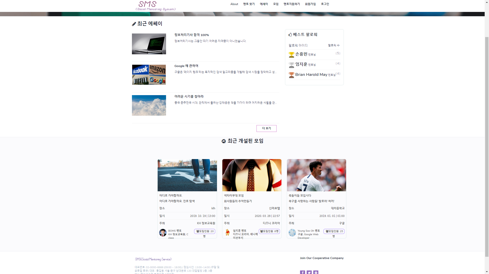
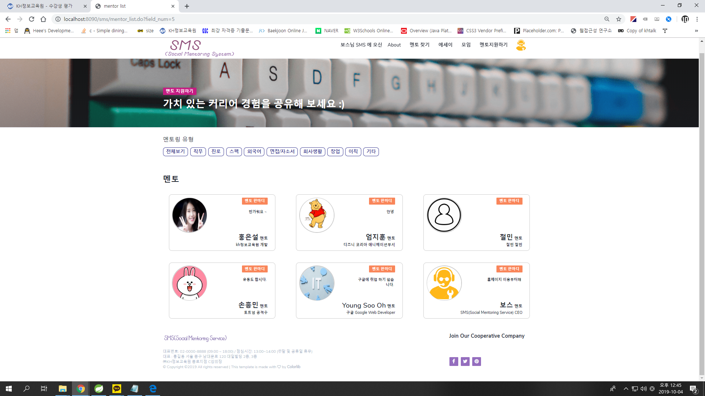
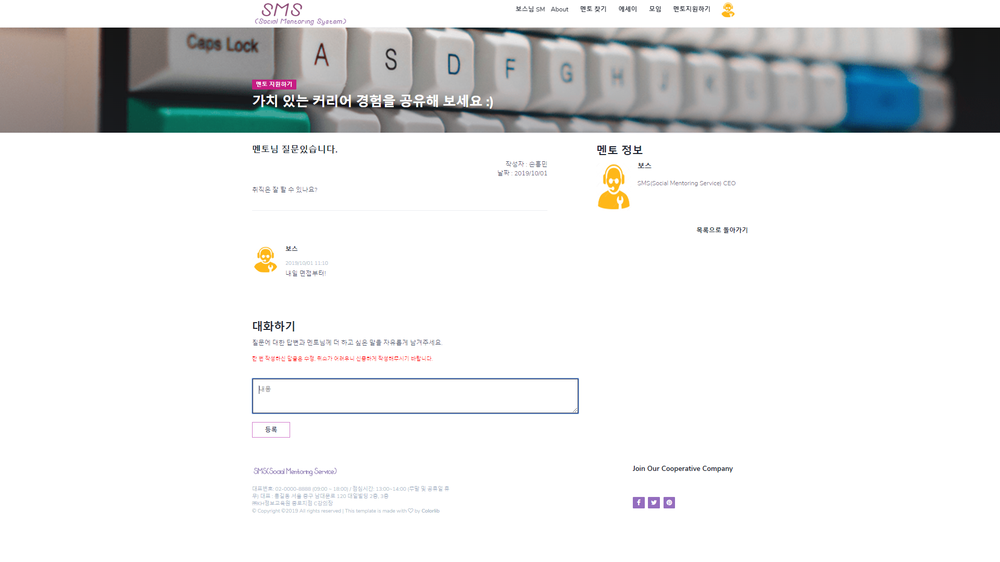

# SMS

## About Project
- 취준생과 회사원을 위한 멘토링 시스템

 

## Structure

- 사용자는 원하는 멘토를 팔로우 할수 있다.
- 로그인 및 회원가입을 통해 접근 가능
- 원하는 멘토에게 질문을 할수 있고 답변을 받을 수 있다.

 

## Structure

- 회원은 원하는 모임에 지원할 수 있다.
- 모임이 마감이 되면 마감되었습니다. 라고 뜬다.
- api를 통해 모임의 위치를 확일할수 있다.

 

## Contribute
- KH Academy team SMS
- 오영수
- 이상준
- 김현이
- 엄지훈
- 최범식

[report]: <https://github.com/youngsoo23/SMS-Social-Mentoring-Service-/tree/master/sms>

